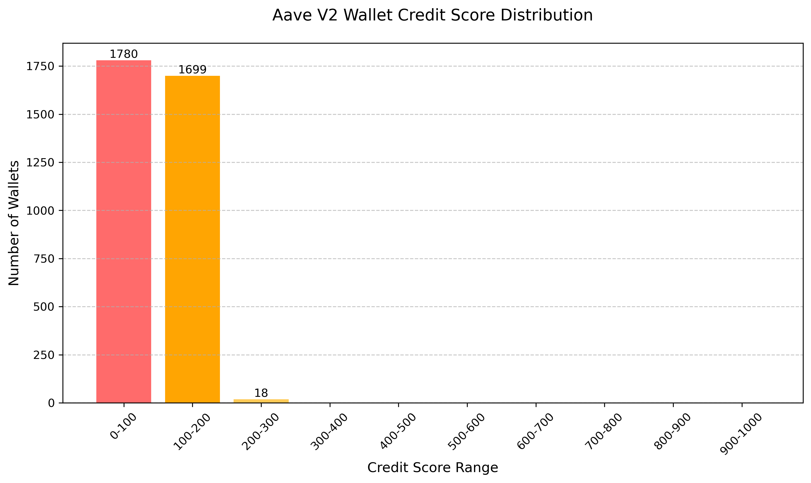

# Aave V2 Wallet Credit Score Analysis

## Overview

Analyzed 3497 unique wallets from user-wallet-transactions.json

## Score Distribution
| Score Range | Number of Wallets | Percentage |
|-------------|-------------------|------------|
| 0-100 | 1780 | 50.9% |
| 100-200 | 1699 | 48.6% |
| 200-300 | 18 | 0.5% |
| 300-400 | 0 | 0.0% |
| 400-500 | 0 | 0.0% |
| 500-600 | 0 | 0.0% |
| 600-700 | 0 | 0.0% |
| 700-800 | 0 | 0.0% |
| 800-900 | 0 | 0.0% |
| 900-1000 | 0 | 0.0% |

## Detailed Wallet Analysis by Credit Category

### Very Poor (0-200)
Count: 3479 wallets (99.5% of total)

Behavioral Characteristics:
- 📊 Transactions: Median 3.0 per wallet
- 🏦 Assets: Median 2.0 different assets
- 💰 Deposit Ratio: Median 100.0%
- ⚠️ Liquidations: 2.9% of wallets
- 🕒 Wallet Age: Median 2.8 days
- 🤖 Bot-like Patterns: 0.9% of wallets
- 💵 Median Volume: $4,973,320,223,487,692,800.00 USD

### Poor (200-400)
Count: 18 wallets (0.5% of total)

Behavioral Characteristics:
- 📊 Transactions: Median 3.0 per wallet
- 🏦 Assets: Median 2.0 different assets
- 💰 Deposit Ratio: Median 100.0%
- ⚠️ Liquidations: 0.0% of wallets
- 🕒 Wallet Age: Median 27.6 days
- 🤖 Bot-like Patterns: 0.0% of wallets
- 💵 Median Volume: $136,586,327,744,907,984,896.00 USD

## Risk Recommendations

| Category | Suggested Action |
|----------|------------------|
| Excellent (800-1000) | Offer preferential rates, higher limits |
| Good (600-800) | Monitor for upgrade potential |
| Fair (400-600) | Educational outreach, moderate limits |
| Poor (200-400) | Reduced limits, increased monitoring |
| Very Poor (0-200) | Strict limits, potential restrictions |

## Methodology

Credit scores (0-1000) incorporate:
- Transaction Activity (25%): Frequency and consistency
- Asset Diversity (20%): Variety of assets interacted with
- Deposit Behavior (35%): Deposit-to-borrow ratio
- Wallet Longevity (20%): Account age and activity duration
- Risk Penalties: Liquidations (-100 each), bot-like patterns (-150), value volatility
